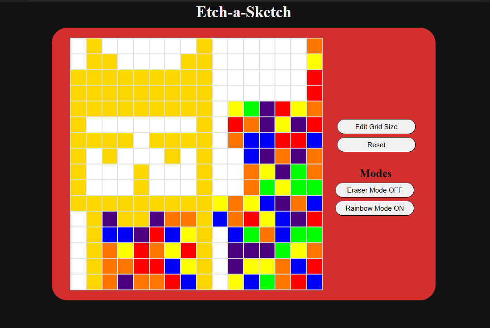

# 🎨 Etch-a-Sketch

## 🧾 Project Overview
A fun web-based sketch pad where users can draw by hovering their mouse over the grid. You can change grid size, switch between modes (like Rainbow Mode and Eraser Mode), or reset to start fresh.

## 🎨 Demo

## ✨ Features
- Golden hover trail for a stylish sketching effect
- **Edit Grid Size** -  To change number of squares per side
- **Reset Button** - Clear the sketch and reset all settings
- **Modes** - Switch between Eraser and Rainbow modes

## 🎨 Modes
- **Eraser Mode** - Creates a white hover trail to erase previous colors
- **Rainbow Mode** - Changes the hover trail color to a random rainbow color (VIBGYOR)

## 🛠️ Tech Stack:
- **Frontend:** HTML, CSS (Flexbox), JavaScript
- **Tools:** VS Code, Chrome DevTools

## 🚀 Live Demo:
[Visit Website]()

## 👨‍💻Author:
Rugved Bajare
- [Github Profile](https://github.com/Rugved1218)
- [Linkedin Profile](https://www.linkedin.com/in/rugved-bajare/)

## 📫 Contact
Feel free to reach out for collaboration or feedback!

